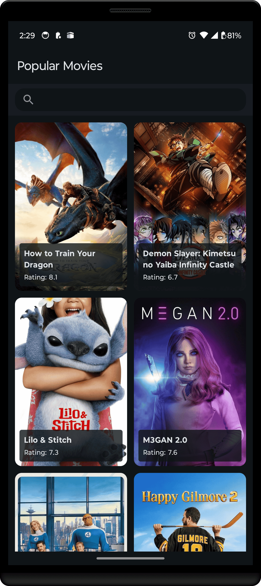
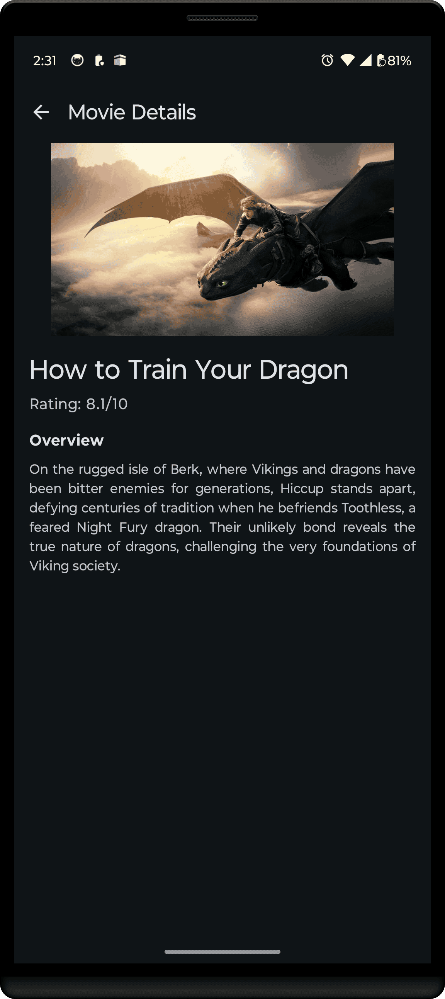
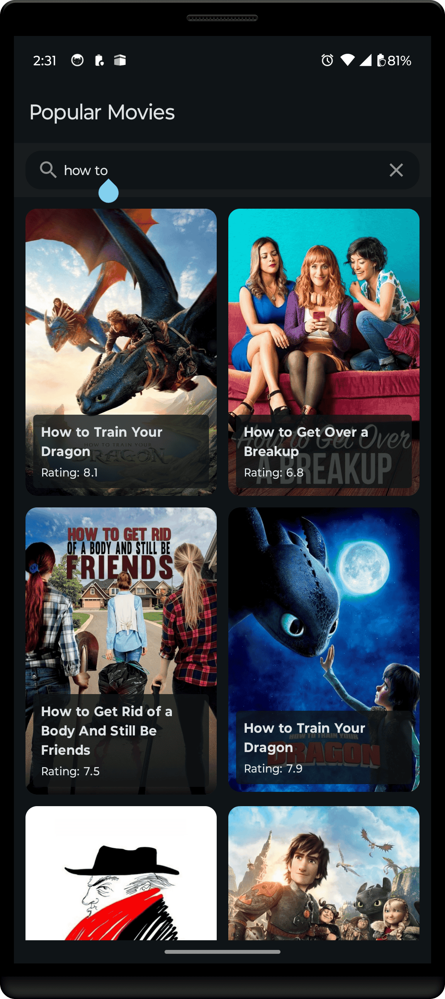

# 🎬 TMDB - The Movie Database Android App

A modern Android application that allows users to discover and explore movies using The Movie Database (TMDB) API. Built with Clean Architecture, MVI pattern, and Jetpack Compose.

## ✨ Features

- **🔍 Movie Discovery**: Browse popular movies with infinite scrolling
- **🔎 Smart Search**: Real-time movie search with debounced input
- **📱 Movie Details**: Detailed information about each movie
- **🎨 Modern UI**: Beautiful Material Design 3 interface built with Jetpack Compose
- **⚡ Performance**: Efficient pagination and image loading
- **🔄 Offline Support**: Local caching with Room database
- **🏗️ Robust Architecture**: Clean Architecture with MVI pattern

## 📱 Screenshots

| Movie List | Movie Details | Search |
|------------|---------------|--------|
|  |  |  |

## 🛠️ Tech Stack

### **Core Technologies**
- **Language**: Kotlin
- **UI Framework**: Jetpack Compose
- **Architecture**: Clean Architecture + MVI (Model-View-Intent)
- **Dependency Injection**: Hilt
- **Async Programming**: Coroutines + Flow

### **Networking & Data**
- **HTTP Client**: Retrofit + OkHttp
- **JSON Parsing**: Moshi
- **Image Loading**: Coil
- **Pagination**: Paging 3
- **Local Database**: Room

### **Testing**
- **Unit Testing**: JUnit 5
- **Testing Utilities**: Truth, MockK, Turbine

### **Development Tools**
- **Build System**: Gradle (Kotlin DSL)
- **Code Generation**: KSP (Kotlin Symbol Processing)
- **Min SDK**: 24 (Android 7.0)
- **Target SDK**: 36
- **Compile SDK**: 36

## 🏗️ Architecture

This project follows **Clean Architecture** principles with **MVI (Model-View-Intent)** pattern for the presentation layer.

### **Architectural Layers**

```
┌─────────────────────────────────────┐
│           Presentation              │
│   (ViewModels, Compose UI, MVI)     │
└─────────────────────────────────────┘
                   │
┌─────────────────────────────────────┐
│              Domain                 │
│        (Use Cases, Models)          │
└─────────────────────────────────────┘
                   │
┌─────────────────────────────────────┐
│               Data                  │
│  (Repository, API, Database, DTO)   │
└─────────────────────────────────────┘
```

### **MVI Pattern**
- **Model**: Represents the state of the UI
- **View**: Jetpack Compose UI that observes state
- **Intent**: User actions that trigger state changes

### **Key Components**
- **MviManager**: Custom implementation for handling state, intents, and effects
- **Use Cases**: Single-responsibility business logic
- **Repository Pattern**: Abstract data source management
- **Dependency Injection**: Hilt modules organized by layers

## 📁 Project Structure

```
app/src/main/java/com/movie/tmdb/
├── feat/                           # Feature modules
│   └── movie_list/                 # Movie list feature
│       ├── data/                   # Data layer implementation
│       ├── domain/                 # Business logic and models
│       ├── presentation/           # UI layer (Compose + ViewModels)
│       ├── navigation/             # Feature navigation
│       └── di/                     # Feature DI modules
├── core/                           # Core utilities and shared components
│   ├── design_system/              # UI theme and components
│   ├── di/                         # Core DI modules
│   └── constants/                  # App-wide constants
└── foundation/                     # Architecture foundation
    ├── domain/                     # Base domain classes
    └── presentation/               # MVI framework and base UI classes
```

## 🚀 Getting Started

### **Prerequisites**
- Android Studio Koala or newer
- JDK 21
- Android SDK 36

### **Setup**
1. **Clone the repository**
   ```bash
   git clone https://github.com/abdelhamid-f-nasser/TMDB-MVI.git
   cd TMDB
   ```

2. **API key is embedded in the native module**

3. **Build and Run**
   ```bash
   ./gradlew assembleDebug
   ```

## 🙏 Acknowledgments

- [The Movie Database (TMDB)](https://www.themoviedb.org/) for providing the movie data API
- [Android Architecture Samples](https://github.com/android/architecture-samples) for architecture inspiration
- [Jetpack Compose](https://developer.android.com/jetpack/compose) for the modern UI toolkit

---
